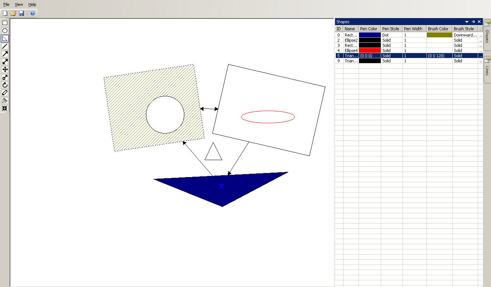

# Vocker - simple vector graphics editor

## Features:
+ 3 shape types: ellipse, rectangle and triangle
+ Shape manipulations: create, delete, move, resize, normalize, rotate
+ Lines - to create connections between shapes
+ Changing brush/pen colors and type for shapes and lines
+ Saving and reading pictures
